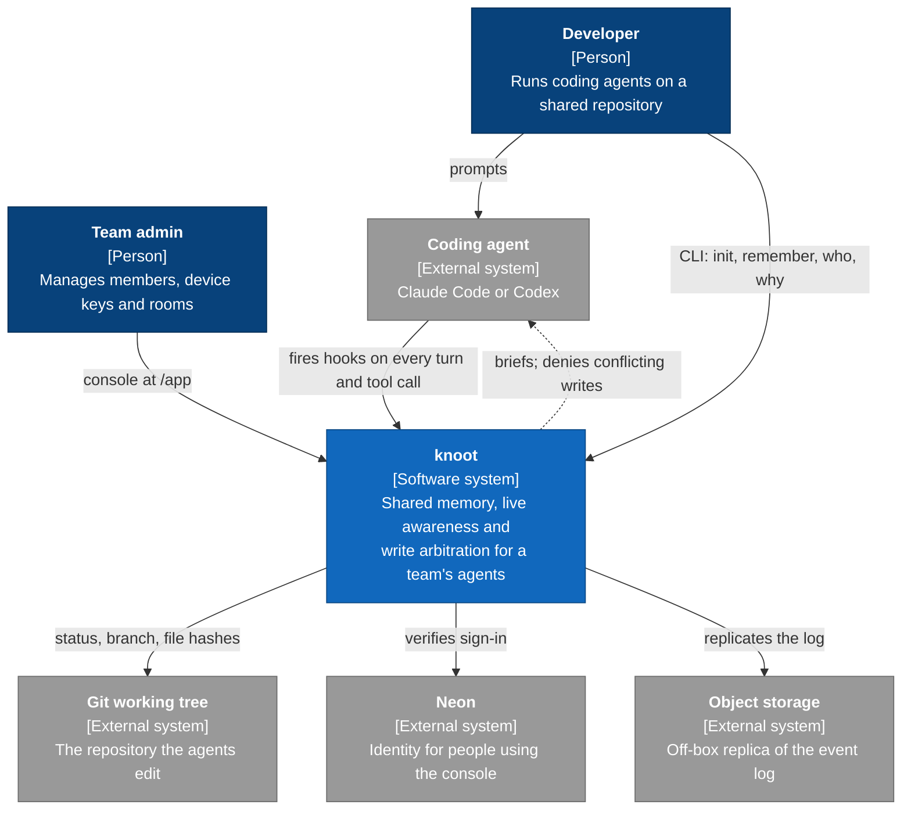
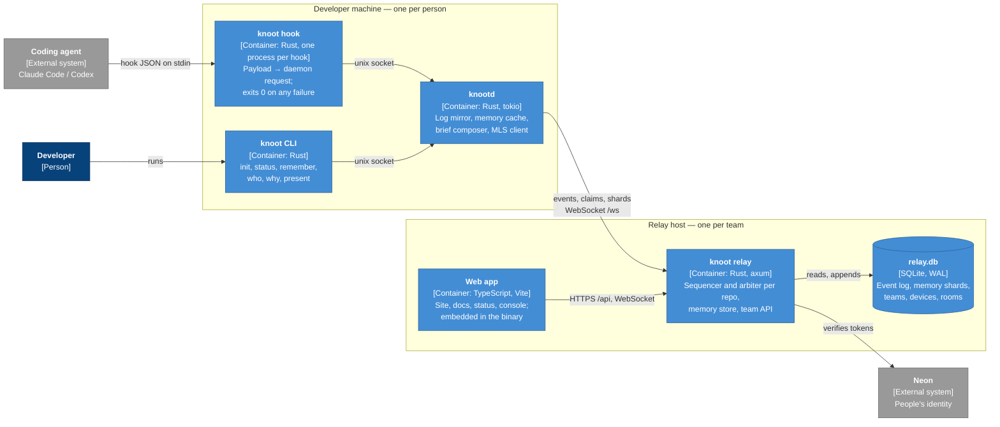
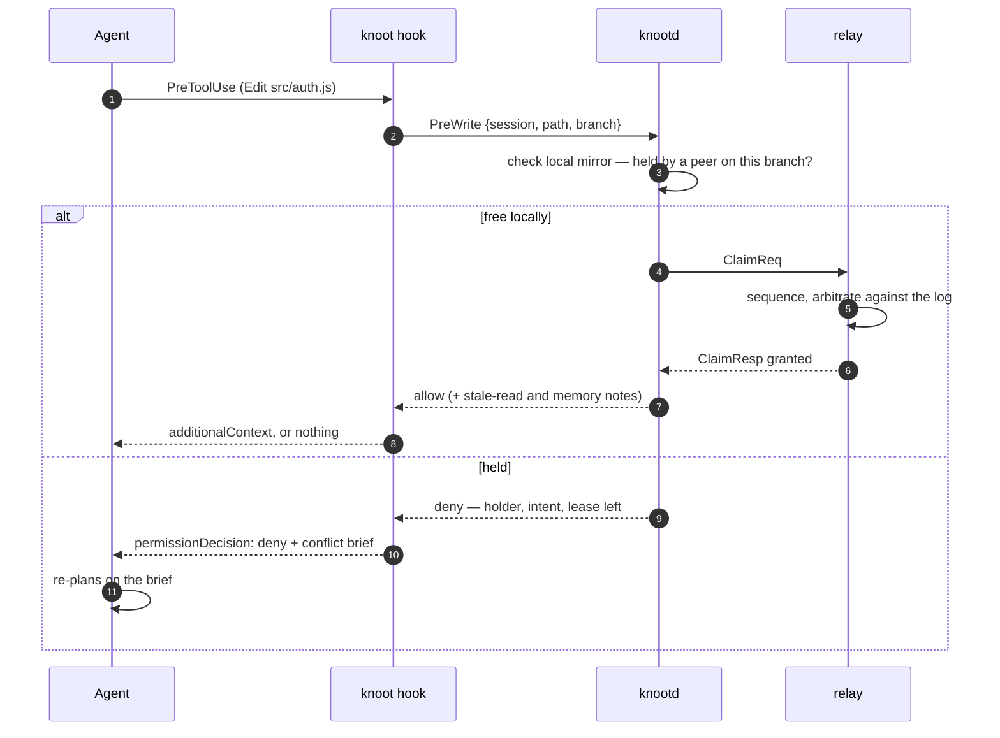
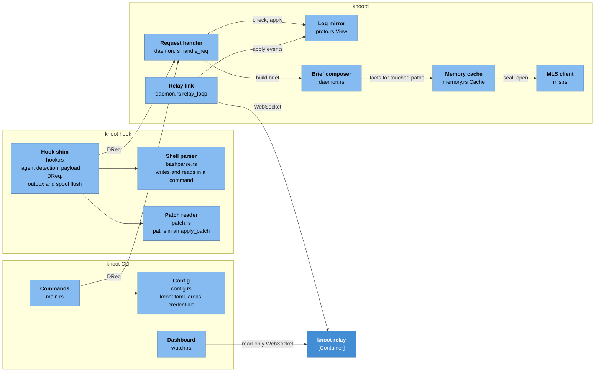
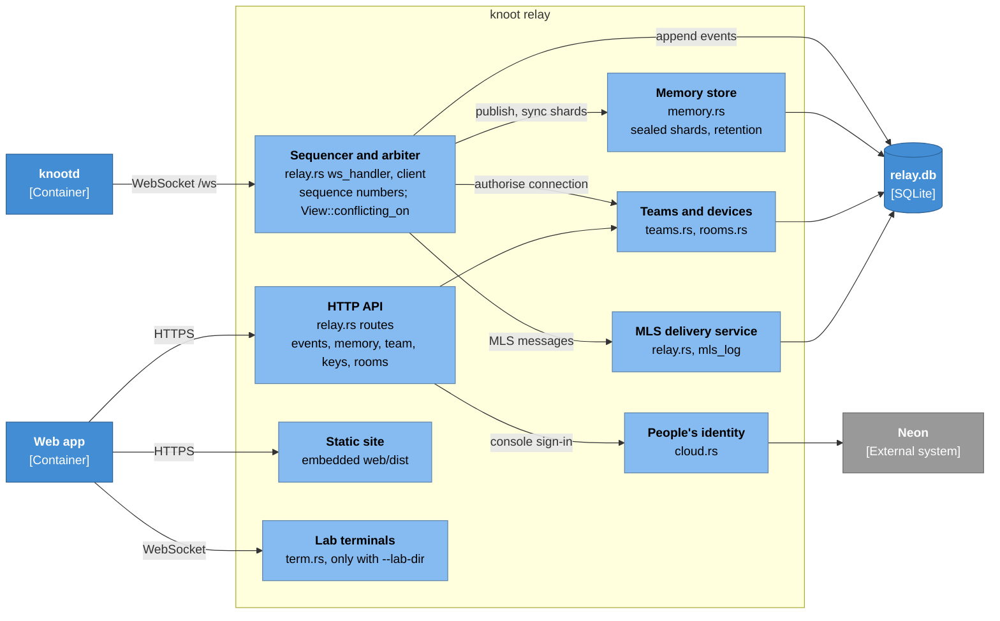
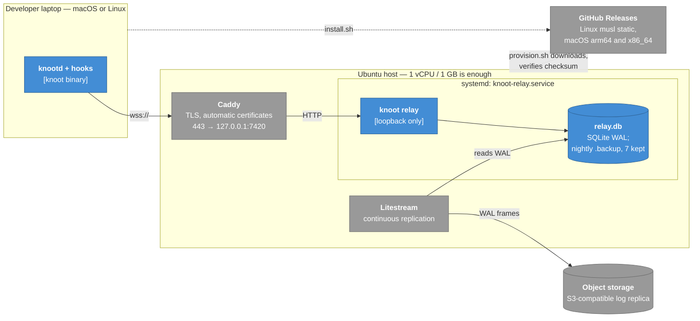

# knoot

**Your team's agents share what they know — and are told when what they know
has stopped being true.**

A fact one agent worked out reaches the next one on the turn it opens the same
code, without anyone running a command. A fact names the files it is about, so
when a colleague changes one of them the fact is flagged *possibly stale* and
says who moved it. What a session is doing right now reaches every peer in the
same part of the repo before their paths overlap. And because the same hook
sees every write, the rare moment two agents do meet on one file is caught
before git would report it.

**If knoot breaks, your agents do not know.** Every failure path ends in an
allowed write: relay unreachable, token refused, daemon dead, key missing,
memory unreadable — the agent is told nothing and carries on. Tests fail the
build if that stops being true, which is why this can be installed on a repo
people are actually paid to work in.

**Code never leaves your machine.** Only paths, intent sentences and the facts
somebody chose to publish cross the wire — and under the `mls` key provider the
relay cannot read even those.

Works with **Claude Code** and **Codex**, through their native hooks: no MCP
server, no tool the model has to think to call.

```sh
curl -fsSL https://raw.githubusercontent.com/Ash20pk/knoot/main/install.sh | sh
knoot daemon &                                 # one per machine
cd your-repo && knoot init --relay wss://knoot.dev/ws
knoot remember --name money --path src/billing.js "all money is integer cents; never floats"
```

The next agent to open `src/billing.js` has that fact on its brief.

---

## Contents

This README follows the [C4 model](https://c4model.com): it starts with knoot
as one box among the people and systems around it, then opens that box one
level at a time. Diagrams use C4's notation — dark blue for people, blue for
knoot's own system, containers and components, grey for external systems.

1. [Getting started](#getting-started)
2. [Level 1 — System context](#level-1--system-context): who uses knoot and what it talks to
3. [Level 2 — Containers](#level-2--containers): the processes and stores that make it up
4. [Level 3 — Components](#level-3--components): the modules inside each container, and what they do
5. [Level 4 — Code](#level-4--code): the types and rules everything else is built on
6. [Deployment](#deployment): a hosted relay, end to end
7. [Operating a team](#operating-a-team)
8. [Security model](#security-model)
9. [CLI reference](#cli-reference)
10. [Development](#development)
11. [Known limitations](#known-limitations)
12. [License](#license)

---

## Getting started

### Install

```sh
curl -fsSL https://raw.githubusercontent.com/Ash20pk/knoot/main/install.sh | sh
```

The installer takes the latest release for Linux x86_64 (static) or macOS
(Apple silicon or Intel), verifies its SHA-256 and puts it in `~/.local/bin`.
`KNOOT_VERSION=nightly` takes the newest build of `main`; `KNOOT_INSTALL=<dir>`
installs elsewhere. Anywhere else, build from source:

```sh
cargo install --git https://github.com/Ash20pk/knoot
```

One binary is the relay, the daemon, the hook shim and the CLI. Agent hooks
call it **by name**, so it must be on `PATH` — or set `KNOOT_BIN`.

### Run it

```sh
knoot relay --listen 0.0.0.0:7420   # one shared relay for the team (or use knoot.dev)
knoot daemon                        # one per machine
cd your-repo && knoot init          # writes .knoot.toml and installs hooks for Claude Code and Codex
```

Restart the agent sessions in that repo, then check it is really on:

```
$ knoot status
[ok  ] binary    /usr/local/bin/knoot
[ok  ] repo      /Users/you/project (id: project-4f2a1c)
[ok  ] hooks     6 events, resolved from PATH
[ok  ] daemon    responding
[ok  ] relay     wss://relay.example.com/ws (token: present)

coordination is on.
```

Because knoot fails open, a broken install looks exactly like a quiet one from
inside an agent. `knoot status` is how a human tells the difference; anything
less than the above prints what is wrong and the command that fixes it.

### Use it

```sh
knoot remember --name money --path src/billing.js "all money is integer cents"   # a fact
knoot cache --name "how tests run" --path test.js "node test.js"                 # derived knowledge
knoot plan --path src/billing.js --decided "cents, not floats" "rewriting tax rounding"
knoot who                     # who is here, what they are doing, what they hold
knoot why src/billing.js      # one file's story, read back from the log
knoot recall                  # what this repo's memory holds
```

None of these are needed by an agent. Everything they would print is pushed
into the agent's context on every turn — that is the design.

---

## Level 1 — System context



| Actor or system | Relationship to knoot |
|---|---|
| **Developer** | Runs agents; occasionally publishes a fact or asks `knoot why`. Can join as a person with `knoot present`. |
| **Coding agent** | Claude Code or Codex. Never calls knoot deliberately; its hooks do, and knoot answers with context or a denial. |
| **Team admin** | Mints device keys, adds people, defines rooms — in the console or with `knoot member`. |
| **Git working tree** | Source of the repo id (from `origin`), the branch, `.gitignore` and file hashes. Contents are hashed locally and never sent. |
| **Neon** | Optional. Only people signing in to the hosted console need it; machines authenticate with device keys and never touch it. |
| **Object storage** | Optional. Litestream replicates the relay's SQLite log there so losing the box loses seconds, not the log. |

**The one finding the system is built on: pushed context works on the weakest
model; offered context is ignored by it.** In lab runs, Haiku agents told
outright to run `knoot who` never did — but a fact placed on their brief
changed the code they wrote in three of four sessions, with no other source
for it. So nothing an agent needs sits behind a command.

---

## Level 2 — Containers



| Container | Runs | Responsibility |
|---|---|---|
| **knoot hook** | A short-lived process per hook event | The only code that knows which agent is calling. Reads the payload on stdin, asks the daemon, answers in the agent's output format. Every failure path exits 0 with no output. |
| **knootd** | `knoot daemon`, one per machine, socket at `~/.knoot/knootd.sock` | Holds a mirror of each repo's log, so the pre-write check is local (microseconds). Keeps the decrypted memory cache, composes each turn's brief, publishes session context, holds the MLS group state. |
| **knoot CLI** | The same binary, on demand | Setup (`init`, `login`, `join`, `status`) and the human-facing views (`who`, `why`, `recall`, `watch`). |
| **knoot relay** | `knoot relay`, one per team | One sequencer per repo: assigns every event a sequence number, arbitrates claims, fans events out. Stores sealed memory shards it may not be able to read. Serves the HTTP API and the embedded web app. |
| **relay.db** | SQLite in WAL mode | The event log is the product: claims are a policy over it, messages travel through it, the audit trail *is* it. |
| **Web app** | Vite multi-page build in `web/`, embedded with `include_dir!` | `/` site, `/docs`, `/status`, `/app` team console, `/ops` single-team operator view, `/lab` browser lab. One binary serves all of it — no second deployment, no CORS. |

### One edit, end to end



End to end — process spawn, socket, relay round trip — this is single-digit
milliseconds.

### What crosses the wire

Exhaustively, every field on every event and message in `src/proto.rs`:

| leaves the machine | never leaves |
|---|---|
| repo-relative **paths** of files claimed, written, read-and-gone, created or removed | file **contents**, in any form |
| the **repo id** (derived from the `origin` URL) and the **branch** name | diffs, patch hunks, `Write` bodies |
| **session ids**, and the **person** behind them (from the device key) | shell **commands** — parsed locally; only the paths they touch are sent |
| an **intent**: the first 160 characters of each prompt | tool **output** — never read |
| **messages** sent with `knoot msg`, in your own words | the **transcript** — never opened |
| **facts, plans and cache entries** somebody chose to publish — sealed on your machine | what a session *read* — kept in the daemon |
| a SHA-256 of each file a fact names, inside the sealed shard | which lines changed, or how many |

The **intent** is the one field that carries what a person typed: paste a stack
trace into the first line of a prompt and its first 160 characters reach peers.
It is capped for that reason. `the_transcript_and_tool_response_are_never_read`
in `tests/codex.rs` asserts the right-hand column against the bytes the relay
actually stored.

---

## Level 3 — Components

### Inside the binary on a developer machine



| Component | Source | What it does |
|---|---|---|
| **Hook shim** | `src/hook.rs` | Claude Code and Codex send the same envelope and accept the same output contract; they differ in what an edit looks like (`Write`/`Edit`/`MultiEdit`/`NotebookEdit` vs one `apply_patch`). Agent is named on the installed command line, else inferred from the payload. Before anything else it flushes `.knoot/outbox/` and `.knoot/spool/`. |
| **Shell parser** | `src/bashparse.rs` | Finds write targets — redirects, heredoc targets, `tee`, `sed -i`, `cp`/`mv`, `rm`, `dd of=` — respecting quoting and skipping heredoc bodies. Also extracts reads (`cat`, `sed -n`, `grep`), because Codex has no read tool. Says when a command could not be proven read-only. |
| **Patch reader** | `src/patch.rs` | Returns the paths and the kind of each operation in an `apply_patch`. Never the hunks. |
| **Request handler** | `src/daemon.rs` | One `DReq` in, one `DResp` out. A patch is checked as a unit: every path is tested before any is claimed. Deletions are announced only once the path is really gone. Unknown repos and every error answer *allow*. |
| **Log mirror** | `src/proto.rs` `View` | The deterministic state machine both daemon and relay replay the log into. Answers *who holds this*, *is it a hub*, *what was written since*, *who is waiting*. |
| **Memory cache** | `src/memory.rs` | Decrypted shards for the areas this member is in. Relevance by path, staleness by file hash, supersession by name. |
| **Brief composer** | `src/daemon.rs` | Turns state into the text an agent sees: peers and their plans, mail, files that moved under the session, facts about the files it touches, cached answers, hub queues. On a denial the same brief rides the refusal. |
| **Relay link** | `src/daemon.rs` | Keeps the WebSocket to the relay, backs off and reconnects, applies the event stream to the mirror. A rejected token turns coordination off with one stderr line; it never blocks a write. |
| **MLS client** | `src/mls.rs` | Under the `mls` provider: one leaf per device in each room's group; the shard key is exported from the group and sent nowhere. |
| **Config** | `src/config.rs` | `.knoot.toml` (committed: relay, repo id, hubs, areas), `~/.knoot/credentials.toml` (0600, keyed by relay origin), CODEOWNERS → areas. |
| **Dashboard** | `src/watch.rs` | `knoot watch`: a read-only client that mirrors the log and redraws. |

### Inside the relay



| Component | Source | What it does |
|---|---|---|
| **Sequencer and arbiter** | `src/relay.rs` | Every event on a repo gets the next sequence number and is appended before it is broadcast. A claim is decided against the same `View` the daemons run, so local pre-checks and the relay agree. Same branch and same area → deny; different branch → allow and record `CrossBranchOverlap`. 400+ concurrent races produce exactly one winner. |
| **HTTP API** | `src/relay.rs` | Read-only data for the console (`/api/repos`, `/api/events`, `/api/memory`) and the team surface (`/api/register`, `/api/tokens`, `/api/members`, `/api/rooms`). Every repo key is namespaced by team id, so one team can never address another's log. |
| **Memory store** | `src/memory.rs` | Stores ciphertext plus what it needs to route: scope, kind, author, epoch, a blinded name for uniqueness. Facts kept 90 days, cache 14, session context for the session. 64 KiB per shard, budget per scope. |
| **MLS delivery service** | `src/relay.rs`, `mls_log` | Orders commits, welcomes and key packages for each room's group. Can read none of them. |
| **Teams and devices** | `src/teams.rs`, `src/rooms.rs` | A key is a **device**, belonging to a **member**, who is in **rooms**; a room grants `(repo, area)` pairs. Keys are stored as SHA-256 hashes and resolved locally with no network call, so the hot path works when everything else is down. Registration is rate-limited per IP. |
| **People's identity** | `src/cloud.rs` | Only when Neon is configured. Verifies a console JWT against Neon Auth's published keys, then reads the person's team through the Data API with their own token, so row-level security bounds it. Holds no database secret. |
| **Lab terminals** | `src/term.rs` | Real `claude` sessions in PTYs, bridged to xterm.js. Spawned only with `--lab-dir`, and gated by the relay's own secret — a terminal is a shell on the host. |

### What the components do together

**Shared memory.** Three kinds, one shape: every entry is scoped to an area,
sealed on the machine that wrote it, and carries its author from the device key.

| | what it is | written by | lives |
|---|---|---|---|
| **facts** | a durable statement: a convention, a decision, a gotcha | `knoot remember` | 90 days; superseded chains kept |
| **repo_cache** | something derived: where a symbol lives, how tests run | `knoot cache` | 14 days; **dropped** when its files change |
| **session_context** | what a session is doing now and what it has settled | the daemon every turn; `knoot plan` to say more | the session |

A fact records a hash of each file it names. A later write to one marks it
*⚠ possibly stale: priya changed src/billing.js since* — unless the file was
written back byte for byte. Writing the same `--name` again supersedes rather
than duplicates, so two agents contradicting each other produce one current
answer and a record of what changed. Session context is composed by the daemon
from the intent and claims a session already declared — never summarised from a
transcript, marked as derived, and stood down the moment the session runs
`knoot plan` itself.

Publishing is **refused** when the text or its source file looks like a
credential: anything `.gitignore`d, `.env*`, `*.pem`, `*.key`, `id_*`, a known
token prefix, or a long key-shaped string. Nothing is ever derived from a
transcript.

**Awareness, pushed every turn.** The brief carries what peers are doing and
have settled, facts and cached answers about the files this session touches,
files it *read* that a peer has since written, creations and deletions that
collide, a peer on the same task, hub queues, who is here and on which branch,
and mail. When a holder releases a file, every session that was denied it is
told — through the `Stop` hook, so the news arrives before the agent ends its
turn.

**Writes, gated.** Every write auto-claims its file on a 10-minute lease,
renewed by activity and expired on crash, so nothing can wedge the repo. A
widely-shared file (three sessions in half an hour, or listed under `hubs`) is
queued on a 2-minute lease instead of owned. Shell writes the parser can read
are gated like the Edit tool; what it cannot read — interpreters, build tools —
is allowed, the tree is fingerprinted before and after, and an `UngatedWrite`
landing on a peer's claim is told to **both** parties at their next hook.
Writes that can be gated are gated; writes nobody could gate are never quiet.

**People in the room.** `knoot present --doing "…"` watches the working tree
through `git status` and registers what you touch through the same requests a
hook uses. You appear in `knoot who` as a **person**, and agents are told not
to wait on you or ask you to release a file — a person cannot be asked to move.

**Codex's sandbox.** Codex runs the agent's own shell commands under a policy
that refuses every socket, so `knoot msg`, `plan`, `remember` and `cache` detect
a refused connect, queue the request under `.knoot/spool/`, and the next hook —
which runs outside the sandbox — sends it. Messages can also be written to
`.knoot/outbox/<user>` with the edit tool. Codex's brief says so; `init` adds
`.knoot/` to `.gitignore`.

---

## Level 4 — Code

The rules everything above relies on live in a handful of types.

### The log: `proto::Event`

Every state change is one of these, sequenced by the relay and replayed by
everyone into the same `View`:

`SessionStarted` · `IntentDeclared` · `ClaimAcquired` · `ClaimDenied` ·
`ClaimReleased` · `PathFreed` · `FileWritten` · `PathRemoved` · `UngatedWrite` ·
`CrossBranchOverlap` · `StaleRead` · `CreateCollision` · `DuplicateIntent` ·
`Message` · `MemoryRefused` · `SessionEnded`

**Agent turns are transactions, not commits.** Agents can be re-run cheaply, so
a collision aborts and re-plans rather than merging. Mutual exclusion cannot be
merged, only arbitrated — so there is one sequencer per repo, no CRDT and no
consensus protocol.

### The state machine: `proto::View`

`View::apply(&Event)` is the only way state changes, so the daemon's mirror and
the relay agree by construction and the log replays deterministically. The
questions it answers:

| Method | Answers |
|---|---|
| `conflicting_on(session, path, branch)` | who holds this path in a way that blocks this session |
| `cross_branch_overlap` | who holds it on another branch — a merge conflict predicted early |
| `is_hub` / `lease_for` / `queue_len` | whether a path is shared enough to queue, and for how long |
| `written_by_other_since` | what moved under a session since it read it |
| `waiters_for` | who to tell when a path is freed |

### The wire: `ClientMsg` / `ServerMsg`, `DReq` / `DResp`

- **Daemon ↔ relay** (`ClientMsg`, `ServerMsg`, JSON over WebSocket): `Hello`,
  `Append`, `ClaimReq`/`ClaimResp`, `ReleaseSession`, memory (`MemPublish`,
  `MemSync`, `MemFetch`, `MemRewrap`, `MemForget`) and MLS
  (`MlsKeyPackage`, `MlsCommit`, `MlsSync`, `MlsRoster`, `Welcome`).
- **Hook/CLI ↔ daemon** (`DReq`, `DResp`, JSON over the unix socket):
  `PreWrite`, `PostWrite`, `PreWriteBatch`, `PostWriteBatch`, `FileRead`,
  `BashPre`, `BashPost`, `SessionStart`, `Intent`, `StopCheck`, `SessionEnd`,
  and the CLI's `Who`, `Msg`, `Poll`, `Remember`, `Plan`, `Cache`, `Recall`,
  `Health`. Answers are `Decision`, `Mail`, `Memory`, `Health`, `Err`.

### Memory: `memory::Shard`, `KeyProvider`, `Refusal`

A `Shard` is ciphertext under AEAD with AAD = `id ‖ scope ‖ kind ‖ author ‖
email ‖ epoch`, so a relay that swaps two shards' metadata produces a
decryption failure, not a silent lie. `KeyProvider` has two implementations:
`Plaintext` (an integrity tag only, for a relay inside your own network) and
the MLS provider (`KNOOT_KEY_PROVIDER=mls` on the relay), where each room is an
RFC 9420 group and removing someone moves the room to an epoch their laptop
cannot derive. `refuse_path` and `refuse_text` return a `Refusal` before
anything is sealed.

### Constants worth knowing (`src/proto.rs`, `src/memory.rs`)

| Constant | Value | Why |
|---|---|---|
| `LEASE_MS` | 10 min | renewed on activity; a crashed session releases on its own |
| `HUB_LEASE_MS` | 2 min | renewed by *writing*, so a thinking session gives a shared file up |
| `HUB_WINDOW_MS`, `HUB_SESSIONS` | 30 min, 3 | three sessions in one file in half an hour is a shared dependency |
| `WRITE_WINDOW_MS` | 30 min | how long "changed under you" stays worth saying |
| `SESSION_STALE_MS` | 12 h | an idle session at its prompt is alive |
| `FACTS_RETAIN_DAYS`, `REPO_CACHE_RETAIN_DAYS` | 90, 14 | |
| `MAX_SHARD_BYTES` | 64 KiB | |

### Stored tables (`relay.db`)

`events` (repo, seq, ts, json) · `memory_shards` · `teams` · `members` ·
`devices` · `tokens` · `rooms` · `room_members` · `room_areas` ·
`mls_key_packages` · `mls_log`

---

## Deployment



`deploy/` provisions this on a fresh Ubuntu host:

```sh
scp -r deploy root@<host>:/root/
ssh root@<host> 'DOMAIN=relay.example.com APEX=example.com bash /root/deploy/provision.sh'
```

Point `A` records for both names at the host first; Caddy gets certificates on
the first request. The script is idempotent — re-run it to deploy a new
revision — keeps the existing token rather than rotating it out from under the
team, and refuses to claim success until it has checked that the relay rejects
an untokened request, accepts a tokened one and has a replicable log. It
downloads the binary CI built rather than compiling on a 1 GB box, verifies the
checksum, and swaps it in only once everything around it is in place.
`SOURCE=build` compiles on the box instead.

**Not losing the log.** Two layers, because they fail differently: nightly
`sqlite3 .backup` snapshots on the box (never `cp`, which half-copies a WAL
database), and Litestream replication off it, which turns itself on once
`/etc/knoot/litestream.env` exists and says loudly while it is off. The relay
runs `journal_mode=WAL`; a test asserts it, because against a rollback journal
Litestream copies nothing and reports success.

### Releases

CI (`.github/workflows/release.yml`) builds the web app, runs the test suite on
Linux and builds all three binaries on every push to `main`, publishing them as
the moving `nightly` pre-release. A `v*` tag matching `Cargo.toml`'s version
publishes a versioned release, which is what `install.sh` takes by default.

### Configuration

Three places hold the Neon URLs. None of them is a secret: the browser signs
in against Neon Auth, the Data API answers only what row-level security allows
the signed-in person, and the relay checks the same JWT against Neon Auth's
published keys. There is no service key anywhere.

The browser reaches Neon Auth at `/neon-auth` on the site's own origin — Caddy
in production, the Vite proxy in development — so the session cookie is
first-party and survives browsers that block third-party cookies.

| Where | What goes there | Why |
|---|---|---|
| `web/.env` (gitignored) | `VITE_NEON_AUTH_URL=/neon-auth`, `NEON_AUTH_UPSTREAM`, `VITE_NEON_DATA_API_URL` | Local development; the dev proxy forwards `/neon-auth` to the upstream |
| GitHub Actions variables | `NEON_AUTH_URL=/neon-auth`, `NEON_DATA_API_URL` | Baked into the released binary's front end |
| `/etc/knoot/neon.env` on the relay host | `NEON_AUTH_URL` (the real Neon Auth URL), `NEON_DATA_API_URL` | The relay verifies sign-in and resolves team membership; the provisioner points Caddy's `/neon-auth` at the same URL |

| Variable | Read by | Effect |
|---|---|---|
| `KNOOT_RELAY_TOKEN` | relay | requires a bearer token on `/ws`, the data APIs and the lab |
| `KNOOT_KEY_PROVIDER=mls` | relay | rooms become MLS groups; the relay cannot read memory |
| `KNOOT_TOKEN` | daemon | overrides the stored credential, for CI and containers |
| `KNOOT_BIN` | hooks | where the binary is, if not on `PATH` |
| `KNOOT_USER` | CLI | local session name for mail; authorship always comes from the device key |

Without Neon the relay still runs and device keys still work; the console
says sign-in is not configured. To attach a project, enable Neon Auth and the
Data API on its branch (`neon neon-auth enable`, `neon data-api create
--auth-provider neon_auth`), apply `db/migrations` in order as the owner role,
then `neon data-api refresh-schema`.

---

## Operating a team

### Enrolling a repository

```sh
knoot init --relay wss://relay.example.com/ws     # once, by one person
git add .knoot.toml .claude/settings.json .codex/hooks.json && git commit
```

All three files are meant to be committed — `.knoot.toml` never carries a
secret — so a clone is enrolled for whichever agent the person runs. Codex asks
you to trust a repository's hooks once (`/hooks` inside Codex). Each teammate
then needs the binary, `knoot daemon` running, and a device key.

On a repo big enough that "everyone" is the wrong audience, divide it into
**areas**, the unit of who can collide with whom. Declaring none means one
area, `/`, holding the whole repo.

```sh
knoot areas                                 # how this repo divides
knoot areas --import-codeowners --write     # take the division from CODEOWNERS
```

### People and keys

People and machines authenticate differently, on purpose. A person signs in to
the console with email and password; a machine presents a **device key**
minted for one person and one laptop, so revoking one costs nothing else.

```sh
knoot join <key> --relay wss://knoot.dev/ws   # store a key and print who it names
knoot member add priya@example.com --label "priya laptop"   # self-hosted: prints the key once
knoot member ls
knoot member rm priya@example.com             # their keys stop; nobody else's change
```

The last live key and the last person holding one cannot be removed — there is
no recovery path and nobody to ask. A **room** is an access group over areas;
every team starts with one called `general` over every repository, so a small
team never meets the word.

### Self-hosting with a token

```sh
KNOOT_RELAY_TOKEN=$(openssl rand -hex 24) knoot relay --listen 0.0.0.0:7420
knoot login --relay wss://relay.example.com/ws --token <token>   # each teammate, once
```

Use `wss://` off-machine; terminate TLS at a proxy. **A relay that refuses you
still fails open**: a rejected token turns coordination off with one stderr
line, and every edit is allowed. An operator's mistake cannot become the
team's outage.

### knoot.dev

The hosted relay. `/` is the site, `/docs` the documentation, `/status` a live
health check, `/app` the console: a **Get started** flow ticked from what the
relay actually knows, then the live log, **Memory** (what the rooms know, who
wrote it, whether it is stale) and **History** (`knoot why` in a browser).

---

## Security model

**The relay operator sees** teams, members, devices, rooms, areas and every
event on the log — paths, intents, who, when — plus, for memory, shard counts,
kinds, sizes, authors, epochs and which shards share a name. Under `mls`: no
shard plaintext and no key. Under `plaintext`: everything, by design, on a box
you run.

**A room member sees** every shard in the areas they are in. There is no
per-member read scoping inside an area; someone who should not read something
belongs in a different area.

**Defended:** device keys and invitations stored as hashes; one team cannot
read, list or revoke another's anything (tested through the HTTP surface);
authorship taken from the key, never from what a client says; credentials
refused at publish time; transcripts and tool output never read.

**Not claimed:** zero-knowledge — paths and intents *are* the product;
protection against a member's own compromised machine; protection against a
relay that withholds a shard, which it can do without reading it.

Report a vulnerability privately through GitHub's security advisories on this
repository rather than in a public issue.

---

## CLI reference

| Command | Does |
|---|---|
| `knoot init [--relay URL] [--agent claude\|codex\|all]` | enrol this repo: `.knoot.toml` and hooks |
| `knoot daemon` | run the per-machine daemon |
| `knoot relay [--listen ADDR] [--db PATH]` | run a relay |
| `knoot status` | is coordination actually on, and if not, why |
| `knoot login --relay URL --token T` / `knoot join KEY` | store a credential for a relay |
| `knoot who` | sessions, people, branches and claims on this repo |
| `knoot watch` | live dashboard |
| `knoot remember --name N [--path P]… TEXT` | publish a fact |
| `knoot cache --name N --path P… TEXT` | publish derived knowledge, dropped when its files change |
| `knoot plan [--path P]… [--decided D]… TEXT` | say what this session is doing and has settled |
| `knoot recall [QUERY]` | what this repo's memory holds |
| `knoot why PATH` | one file's history, from the log |
| `knoot msg USER\|all TEXT` / `knoot inbox` | message a peer; read pending notes |
| `knoot present [--doing TEXT]` | join the room as a person, from any editor |
| `knoot areas [--import-codeowners] [--write]` | show or set how the repo divides |
| `knoot member add\|ls\|rm` | people and device keys on a self-hosted relay |
| `knoot hook [--agent A]` | the shim agents call; not for people |

---

## Development

```sh
npm --prefix web ci && npm --prefix web run build:oss   # the embedded front end
cargo build --release
cargo test                                              # 308 tests, ~20 s
```

`web/dist` is committed because `cargo install --git` cannot run npm and a
relay that cannot serve its own console is not one binary. Rebuild it with
`npm run build:oss` after any change under `web/` — that script points Vite at
an empty env directory, so no project's keys end up in what this repository
serves.

| Layer | File | What it protects |
|---|---|---|
| Unit | `src/proto.rs`, `src/memory.rs` | path overlap, lease expiry, replay determinism, staleness, supersession |
| Memory | `tests/memory.rs` | a fact reaches a peer next turn unasked; scoped fetch by id; `.env` refused; composed context never replaces a plan |
| Encryption | `tests/mls.rs` | a relay dump yields no plaintext or working credential; a removed device cannot derive the next epoch |
| Awareness | `tests/awareness.rs`, `tests/areas.rs` | stale reads, creation collisions, deletions, hubs; area isolation |
| Codex | `tests/codex.rs` | real payload shapes; patch as a unit; shell reads; transcript never sent; outbox and spool |
| Arbitration | `tests/arbitration.rs` | 400+ concurrent races → one winner; briefs carry holder and intent |
| Failure | `tests/failure.rs` | fail-open on dead daemon, dead or slow relay, malformed input; durability across restart |
| Contract | `tests/e2e.rs` | real Claude Code payloads through the binary; exact output JSON; latency ceiling |
| Multi-tenancy | `tests/teams_api.rs` | one team cannot read, list or revoke another's anything |

### The lab

```sh
./lab/demo.sh             # one command: build, seed, three agents in the browser lab
./lab/lab.sh              # four Claude Code sessions in tmux over a live dashboard
./lab/lab.sh reset        # wipe the lab repo and event log first
```

The lab seeds a small repository with a shared goal and tasks that collide on
purpose, so a claim, a denial and a re-plan can be watched as they happen. Two
sessions on one machine also work: `KNOOT_USER=ash claude` in one terminal,
`KNOOT_USER=priya claude` in another.

---

## Known limitations

- **Interpreters are detected, never blocked.** `python3 -c "open(…)"` writes
  first and is reported to both parties second. Knowing what a program writes
  is knowing what it does.
- **Ungated-write attribution is inferred** from a peer's `FileWritten` event;
  if it has not arrived yet the write can be attributed to the wrong session.
- **Inside Codex's sandbox, commands that need an answer now** — `who`,
  `recall`, `why`, `status` — cannot reach the daemon. The brief already
  carries what they would print; commands that publish are queued.
- **Same-name sessions share a mailbox**, because mail is keyed by user.
- **Fail-open is ambiguous by design**: an allowed edit and an unreachable
  daemon look the same from the agent's side. `knoot status` tells them apart.
- **Several agents on one laptop are one person**, because authorship comes
  from the device key. The log still tells them apart by session.
- **Other agents** — Cursor, Copilot — are not integrated yet. Each is a
  matcher, a payload shape and a test file. A person in any editor can join
  with `knoot present`.

Deliberately not planned: fleet mode or merge queues (that is isolation, the
thing knoot is the alternative to), a model in the arbiter (determinism and a
replayable log are the product), and symbol-level claims until the log shows
file-level is what bites.

---

## License

Licensed under either of

- Apache License, Version 2.0 ([LICENSE-APACHE](LICENSE-APACHE))
- MIT license ([LICENSE-MIT](LICENSE-MIT))

at your option.

Unless you explicitly state otherwise, any contribution intentionally submitted
for inclusion in this work, as defined in the Apache-2.0 license, shall be dual
licensed as above, without any additional terms or conditions.
